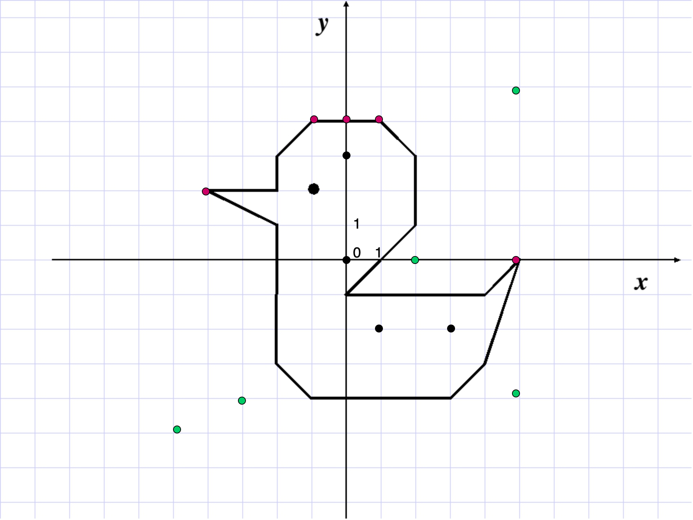
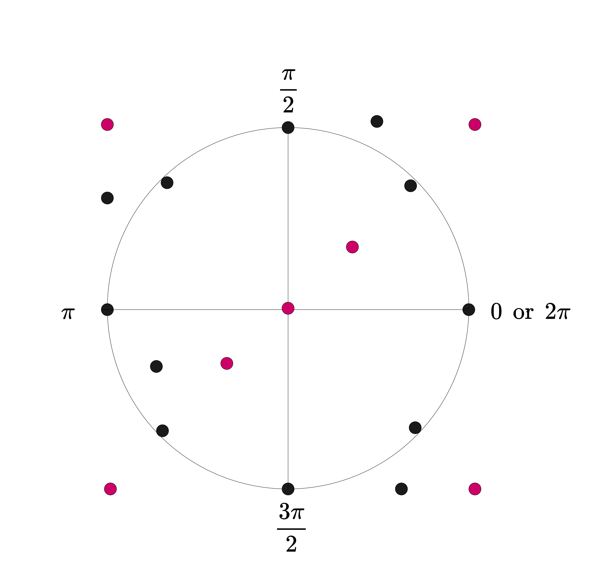

# test-align

## Описание задач
### Task 1
На плоскости задан замкнутый контур без самопересечений, состоящий из отрезков. При этом
начало каждого отрезка совпадает с концом предыдущего. Дополнительно заданы точки для
проверки. Требуется определить, сколько из этих точек находится внутри контура.

**Входные данные:** в первой строке записаны через пробел два числа n и m (2 ≤ n < 10^3, 1 ≤ m < 10^4),
где n – количество отрезков, а m – количество точек для проверки. Следующие 2n строк содержат
координаты концов отрезков. Следующие m строк содержат координаты точек для проверки.
Координаты всех точек заданы целыми числами, по модулю не превосходящими 10^8 и разделены пробелом.

**Вывод:** количество точек, находящихся внутри контура.

### Task 2
Дана окружность на плоскости с центром в точке с координатами (0, 0) и радиусом 80.
1. Создать массив 2D точек размера N cо случайными координатами X из диапазона (-100, 100), Y из (-100, 100).
2. Вывести только те точки массива, расстояние которых до окружности меньше 10. Точки должны
быть отсортированы по проекции на эту окружность (по углу отрезка от точки к центру). Можно
брать любую точку за начальную. 

**Входные данные:** количество точек N.

**Вывод:** упорядоченный список координат точек.

В задаче 2 точки отсортированы по проекции на окружность от 0 до 2pi.

### Task 3
Cоединить несколько линейных фрагментов цепочки, состоящих из разного числа колец в единую
линейную цепь. Для этого можно разгибать кольца, переставлять их и снова сгибать в кольцо. Например,
два фрагмента произвольной длины можно соединить друг с другом разогнув одно кольцо и соединив с
помощью него фрагменты.

**Входные данные:** строка, где через запятую перечислены длины каждого из фрагментов цепи. Числа целые
положительные.

**Вывод:** минимальное кол-во колец, которые придется разогнуть.

## Сборка
Поддержка **CMake 3.10** и **С++17**.

Минимальный пример сборки:

- ``cd test-2gis``
- ``git submodule update --init``
- ``mkdir build``
- ``cd build``
- ``cmake ..``
- ``cmake --build .``

## Запуск

Примеры запуска:

1. ``task1 test.txt``

2. ``task2 N``

3. ``task3 test.txt``

## Тестирование

Запуск googletest:

``test_align_test``

#### Пример теста для первой задачи

11 тестовых точек, 5 из которых находятся внутри контура.

#### Пример теста для второй задачи

19 тестовых точек, у 12 из которых расстояние до окружности меньше 10. 

Обработанные точки отсортированы по проекции на окружность от 0 до 2pi.
